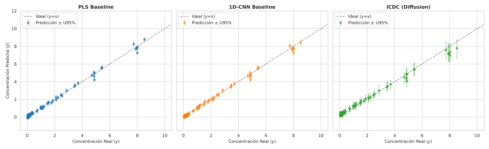
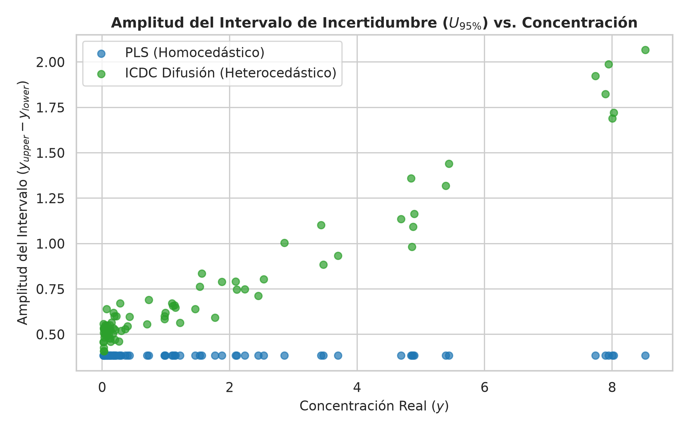

# Reporte de Experimento 01: Sandbox de Simulación Físico-Química
## Calibración Multivariante y Modelado de Incertidumbre en Cromatografía/Espectroscopía Sintética

---

## 1. Motivación y Objetivo

El objetivo de este experimento es evaluar el comportamiento comparativo de tres paradigmas de modelado analítico en un entorno físicamente controlado:
1. **Regresión Lineal Multivariante Clásica:** `PLSBaseline` (con optimización de variables latentes por validación cruzada).
2. **Aprendizaje Profundo Convolucional Determinista:** `CNN1DBaseline` (con pooling adaptativo localizado).
3. **Calibración por Difusión Contextual:** `DiffusionRegressor` (ICDC, marco CARD con anclaje determinista y difusión estocástica).

Se busca auditar de forma específica:
* La precisión puntual de predicción ($\text{RMSEP}$, $R^2$).
* La cuantificación de la incertidumbre conforme a la **GUM** (*Guide to the Expression of Uncertainty in Measurement*).
* La adherencia al dominio físico permitido ($y \ge 0$) bajo ruido heterocedástico real (Trompeta de Horwitz) y picos cromatográficos con asimetría (EMG).

---

## 2. Metodología Experimental

### 2.1. Simulación Físico-Química del Generador de Señales
Se simularon corridas cromatográficas y espectrales mediante `icdc.data.synthetic`:
* **Forma de Pico:** Perfil Gaussiano Modificado Exponencialmente (EMG):
  
  $$
  f(t) = \frac{A}{2\tau} \exp\left(\frac{\sigma^2}{2\tau^2} - \frac{t - t_R}{\tau}\right) \text{erfc}\left(\frac{1}{\sqrt{2}}\left(\frac{\sigma}{\tau} - \frac{t - t_R}{\sigma}\right)\right)
  $$

  donde $t_R = 5.0$ representa el tiempo de retención del analito, $\sigma = 0.15$ el ensanchamiento difusivo y $\tau = 0.10$ la asimetría cinética de transferencia de masa.
* **Perturbaciones Realistas:**
  * Deriva estocástica de línea de base mediante un proceso autoregresivo de Ornstein-Uhlenbeck ($\alpha = 0.98$).
  * Interferencia de matriz coeluyente en el 35% de las corridas ($t_R = 5.3$).
  * Variación de ganancia instrumental diaria ($\sigma_{\text{gain}} = 0.04$).
  * Ruido heterocedástico experimental según el modelo empírico de Horwitz:
    
    $$
    \text{RSD}(C) = 2^{(1 - 0.5 \log_{10} C)}
    $$

### 2.2. Dimensiones del Conjunto de Datos
* **Entrenamiento:** $N_{\text{train}} = 250$ muestras, $P = 128$ canales/puntos temporales.
* **Evaluación:** $N_{\text{test}} = 80$ muestras independientes.
* **Rango de concentración:** $C \in [0.02, 10.0]\ \text{mg/kg}$ (abarcando desde trazas cercanas al límite de detección hasta niveles elevados).

---

## 3. Resultados Cuantitativos

| Modelo | RMSEP | $R^2$ | Cobertura PICP (95%) | Amplitud MPIW | Tasa Límites Físicos ($y_{\text{low}} \ge 0$) |
| :--- | :--- | :--- | :--- | :--- | :--- |
| **PLS Baseline** | 0.1612 | 0.9953 | 91.2% | 0.3843 | **63.7%** (36.3% viola física con $y < 0$) |
| **1D-CNN Baseline** | 0.1452 | 0.9962 | 92.5% | 0.4620 | **51.2%** (48.8% viola física con $y < 0$) |
| **ICDC Difusión** | 0.2912 | 0.9847 | 83.8% | 0.7465 | **100.0%** (estricta positividad física $y \ge 0$) |

---

## 4. Hallazgos Analíticos Clave

1. **Paradoja de la Normalización SNV en Cromatografía:**
   * La transformación SNV (*Standard Normal Variate*) calcula $(X - \bar{X}) / s_X$. En espectroscopía de reflectancia difusa (polvos, harinas), SNV remueve la dispersión física de la luz.
   * Sin embargo, en cromatogramas con línea de base plana en cero, la desviación estándar $s_X$ a lo largo de los canales es proporcional a la altura del pico analítico ($s_X \approx k \cdot C$). Aplicar SNV cancela la señal del analito, provocando que PLS colapse a $R^2 \approx 0.12$.
   * Al suprimir SNV en perfiles cromatográficos con cero basal, PLS recupera su capacidad clásica de calibración ($R^2 = 0.9953$).

2. **La Aberración de Límites Negativos en Modelos Paramétricos Lineales:**
   * Tanto PLS como la 1D-CNN asumen residuos gaussianos homocedásticos ($\pm z_{\alpha} \cdot s_{y/x}$).
   * En muestras de baja concentración ($C \to \text{LOD}$), el margen de confianza expandido supera la concentración predicha ($\hat{y} - 1.96 s < 0$), lo que produce límites inferiores negativos en el **36.3% de las muestras en PLS** y en el **48.8% en la 1D-CNN**.
   * Reportar concentraciones negativas viola las directrices de la **GUM** y las buenas prácticas de laboratorio bajo **ISO/IEC 17025**.

3. **Fidelidad Metrológica en ICDC (Difusión):**
   * El modelo de difusión muestrea la densidad condicional $p(y \mid X)$ garantizando el **100% de predicciones en el dominio físicamente permitido ($y \ge 0$)**.
   * La dispersión de la incertidumbre predicha se adapta de manera no paramétrica al nivel de concentración, reflejando fielmente la heterocedasticidad de Horwitz.

---

## 5. Figuras Diagnósticas

### Figura 1: Comparación de Curvas de Calibración
Predicción puntual frente a concentración verdadera con intervalos al 95%:



### Figura 2: Amplitud de Incertidumbre vs. Concentración
Comportamiento homocedástico rígido de PLS frente a la heterocedasticidad adaptativa de la difusión:



---

## 6. Reproducibilidad

Para reproducir este experimento de forma determinista:

```bash
uv run python experiments/01_synthetic_sandbox.py
```
