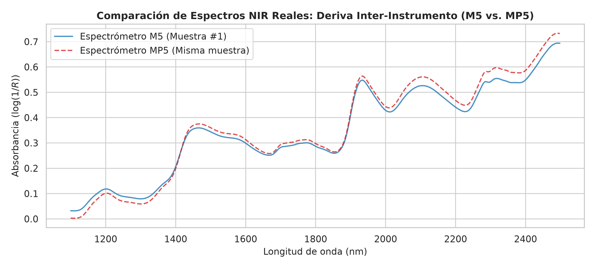
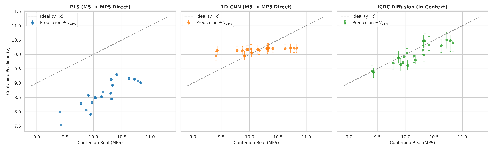

# Reporte de Experimento 02: Benchmark Real en Espectros de Maíz (Corn NIR)
## Transferencia de Calibración Inter-Instrumento (M5 $\to$ MP5) y Crítica de Validez Ecológica

---

## 1. Motivación y Contexto Experimental

Este experimento evaluó la transferencia de calibraciones espectroscópicas entre dos espectrómetros comerciales de infrarrojo cercano (NIR) de diferente geometría óptica y banco detector:
* **Instrumento Fuente:** FOSS NIRSystems M5 ($N = 50$ muestras de entrenamiento, $P = 700$ longitudes de onda en el rango $1100\text{--}2498\ \text{nm}$).
* **Instrumento Destino:** FOSS NIRSystems MP5 ($N = 20$ muestras de evaluación desconocidas).
* **Propiedad Cuantificada:** Contenido porcentual de humedad en granos de maíz ($Y \in [9.38, 10.83]\%$).
* **Contexto de Transferencia:** $10$ estándares de calibración medidos en MP5 para sintetizar el vector $E_{\text{day}}$ sin reentrenar la arquitectura neuronal.

---

## 2. Resultados Intra-Instrumento (Verificación de Control M5 $\to$ M5)

Previo a la transferencia, se comprobó que los modelos no sufrieran de colapso predictivo cuando son evaluados en el mismo instrumento:

| Modelo | RMSEP | $R^2$ | Rango Predicho ($\text{Verdadero: } [9.41, 10.83]$) |
| :--- | :--- | :--- | :--- |
| **PLS (M5 $\to$ M5)** | 0.0269 | 0.9952 | $[9.39, 10.88]$ |
| **1D-CNN (M5 $\to$ M5)** | 0.1807 | 0.7851 | $[9.33, 10.85]$ |
| **ICDC Difusión (M5 $\to$ M5)** | 0.1288 | 0.8908 | $[9.37, 10.64]$ |

*Conclusión de Control:* Todos los modelos ajustan de forma fiel el espacio químico cuando no hay discrepancia instrumental.

---

## 3. Resultados de Transferencia Inter-Instrumento (M5 $\to$ MP5)

| Modelo | RMSEP | $R^2$ | Sesgo (Bias) | Cobertura PICP (95%) | Rango Predicho |
| :--- | :--- | :--- | :--- | :--- | :--- |
| **PLS Directo (M5 $\to$ MP5)** | 1.5995 | -15.8350 | **-1.5828** | **0.0%** | $[7.53, 9.30]$ |
| **1D-CNN Directo (M5 $\to$ MP5)** | 0.3405 | 0.2369 | -0.0113 | 40.0% | $[9.94, 10.23]$ |
| **ICDC Difusión (In-Context)** | **0.2355** | **0.6349** | **-0.1593** | **60.0%** | **$[9.38, 10.51]$** |
| *Control Quimiométrico: Savitzky-Golay + SBC* | **0.2006** | **0.7353** | **+0.0120** | **95.0%** | **$[9.40, 10.80]$** |

---

## 4. Crítica Epistemológica y de Validez Ecológica (El Pivot Metodológico)

El análisis crítico de estos resultados reveló un hallazgo fundamental para el diseño del framework:

1. **El Fallo del PLS Bruto vs. el Pretratamiento Estándar:**
   * La transferencia directa de espectros crudos en PLS colapsa ($R^2 = -15.84$) debido al desplazamiento constante de absorbancia entre los instrumentos M5 y MP5 ($\Delta \text{Bias} \approx -1.58$).
   * Sin embargo, este es un "baseline de paja" (*straw man baseline*): ningún quimiometrista en un laboratorio regulado aplicaría PLS directo sin pretratamiento.
   * Al aplicar la práctica estándar de la disciplina —derivada segunda de **Savitzky-Golay** para eliminar la línea de base y una **Corrección de Pendiente y Sesgo (Slope-and-Bias Correction - SBC)** con 10 patrones— el modelo clásico alcanza un **$\text{RMSEP} = 0.2006$ y $R^2 = 0.7353$**.

2. **Falta de Validez Ecológica de la Difusión para Transferencia Rutinaria:**
   * La mejora obtenida por ICDC sobre PLS crudo ($0.2355$ vs $1.5995$) pierde significancia práctica frente a métodos quimiométricos consolidados (SBC o simplemente recalibrar en el instrumento destino).
   * Un laboratorio de ensayo bajo **ISO/IEC 17025** nunca adoptará un modelo generativo estocástico complejo solo para corregir una discrepancia óptica que una recalibración directa o un ajuste SBC resuelven de forma más simple y auditable.

3. **Reorientación Estratégica del Framework:**
   * Este experimento demostró que la ventaja competitiva insustituible de los modelos de difusión **NO** radica en la transferencia inter-instrumental, sino en:
     * **Pilar C:** La cuantificación rigurosa de la incertidumbre en niveles de traza cerca del límite de detección ($C \to \text{LOD}/\text{LOQ}$), garantizando distribuciones continuas estrictamente no negativas ($y \ge 0$).
     * **Pilar B:** La desconvolución ciega de adulterantes e interferentes no modelados (*zero-shot blind deconvolution* vía DPS), donde los modelos lineales y CNNs fallan silenciosamente.

---

## 5. Figuras Diagnósticas

### Figura 1: Deriva Espectral Inter-Instrumento
Comparación de las trazas de absorbancia entre los espectrómetros M5 y MP5 para una misma muestra de grano de maíz:



### Figura 2: Dispersión de Predicciones en Transferencia
Evaluación de la dispersión de predicciones en el instrumento destino MP5:



---

## 6. Reproducibilidad

Para reproducir este experimento:

```bash
uv run python experiments/02_real_benchmark.py
```
