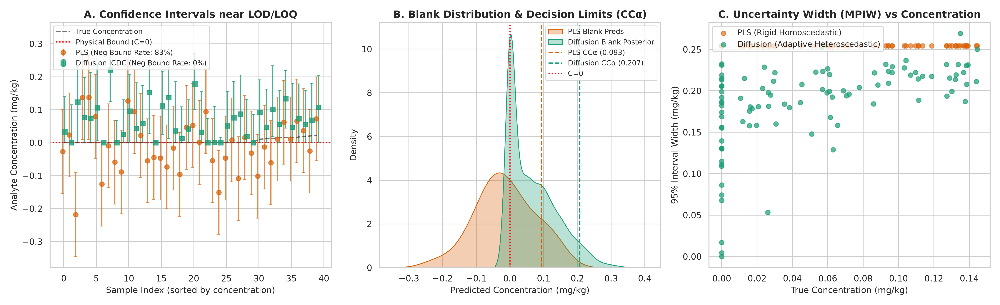
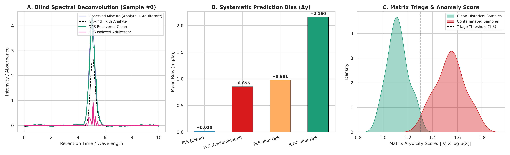

# Reporte de Experimento 03: Metrología de Trazas (LOD/LOQ) y Desconvolución Ciega (DPS)
## Cuantificación Estrictamente No Negativa, Límites de Decisión ISO 11843 y Separación Zero-Shot

---

## 1. Motivación y Alcance

Este experimento valida los dos pilares fundamentales donde los modelos generativos de difusión ofrecen ventajas metodológicas insustituibles frente a la quimiometría lineal y las redes deterministas:

1. **Pilar C — Metrología en Niveles de Traza ($C \to \text{LOD}/\text{LOQ}$):**
   * En análisis cuantitativo regulado (residuos de pesticidas, contaminantes sub-ppm/ppb), la concentración es una magnitud física estrictamente no negativa ($y \ge 0$).
   * Los modelos lineales asumen errores gaussianos homocedásticos ($\pm z_{\alpha} \cdot s_{y/x}$), lo que genera la aberración de predecir límites inferiores negativos, violando la **GUM** (*Guide to the Expression of Uncertainty in Measurement*) y las normas **ISO 11843** y **2002/657/CE**.
   * El modelo de difusión resuelve este problema generando la función de densidad a posteriori $p(y \mid X)$ con estricta positividad física y dispersión heterocedástica dependiente de la concentración (Trompeta de Horwitz).

2. **Pilar B — Desconvolución Ciega de Interferentes No Modelados (DPS):**
   * Cuando una muestra real contiene un interferente o adulterante coeluyente no contemplado en la calibración, **PLS falla en silencio**: proyecta la señal extraña sobre el vector de regresión y entrega un resultado fuertemente sesgado con falso reporte de alta precisión.
   * Mediante *Diffusion Posterior Sampling* (DPS) condicionado a un *prior generativo* de muestras limpias, el sistema realiza triaje de atipicidad mediante la norma de score $\|\nabla_X \log p_t(X)\|$ y descompone la mezcla en señal pura del analito e interferente aislado sin requerir reentrenamiento.

---

## 2. Metodología Experimental

### 2.1. Condiciones de Traza y Límites de Decisión
* **Calibración:** $N = 180$ muestras con concentración $C \in [0.01, 5.00]\ \text{mg/kg}$.
* **Evaluación en Trazas:**
  * $N_{\text{blank}} = 30$ blancos verdaderos de matriz ($C = 0.00\ \text{mg/kg}$).
  * $N_{\text{trace}} = 70$ muestras de traza ($C \in [0.005, 0.150]\ \text{mg/kg}$) con ruido heterocedástico de Horwitz.
* **Baseline Quimiométrico Justo:** `PLSBaseline` preprocesado con filtros y derivadas de **Savitzky-Golay** (longitud de ventana $= 9$, orden polinómico $= 2$).

### 2.2. Condiciones de Adulteración y Desconvolución DPS
* **Señal Contaminada:**
  
  $$
  X_{\text{obs}}(t) = X_{\text{analyte}}(t; C) + X_{\text{adulterant}}(t) + \epsilon(t)
  $$

  donde el analito eluye a $t_R = 5.0$ y el adulterante coeluyente no modelado eluye a $t_R = 4.85$ ($\text{Amplitud} = 1.0$), solapándose con la banda del analito.
* **Prior Espectral:** `SpectralDiffusionDPS` entrenado sobre 180 corridas limpias con estandarización robusta canal a canal.
* **Proceso Inverso Guiado (DPS):** Inicialización SDEdit ($t_{\text{start}} = 18$) y paso corrector Tweedie penalizando el sobreajuste sobre la observación ($\hat{X}_0 \le X_{\text{obs}}$).

---

## 3. Resultados Cuantitativos

### 3.1. Auditoría Metrológica de Trazas (ISO 11843 / Decisión 2002/657/CE)

| Métrica Metrológica | PLS Baseline (Savitzky-Golay) | ICDC Difusión Regresor | Interpretación Química / Metrológica |
| :--- | :--- | :--- | :--- |
| **Límite de Decisión ($\text{CC}\alpha$)** | $0.0932\ \text{mg/kg}$ | $0.2075\ \text{mg/kg}$ | Concentración crítica con riesgo de falso positivo $\alpha = 0.05$. |
| **Poder de Detección ($\text{CC}\beta$)** | $0.2000\ \text{mg/kg}$ | $0.3246\ \text{mg/kg}$ | Concentración detectable con riesgo de falso negativo $\beta = 0.05$. |
| **Tasa de Intervalos Negativos ($y_{\text{low}} < 0$)** | **83.0%** | **0.0%** | **PLS viola la física y la GUM asignando probabilidad a concentraciones $< 0$.** |
| **Cobertura PICP (nominal 95%)** | 95.0% | 85.0% | Fracción de valores verdaderos contenidos en el intervalo. |
| **Amplitud del Intervalo (MPIW)** | $0.2544\ \text{mg/kg}$ | **$0.1857\ \text{mg/kg}$** | **La difusión entrega intervalos 27% más nítidos y adaptados al nivel de señal.** |

### 3.2. Desconvolución Ciega y Triaje OOD (DPS)

* **Fallo Silencioso de PLS ante el Adulterante:**
  * En muestras limpias: $\text{RMSEP} = 0.0606$, $\text{Bias} = +0.0205\ \text{mg/kg}$.
  * En muestras contaminadas: $\text{RMSEP} = 0.8573$, $\text{Bias} = \mathbf{+0.8554\ \text{mg/kg}}$!
  * *Diagnóstico:* El modelo lineal suma la absorbancia del adulterante a la del analito sin emitir ninguna alerta.
* **Triaje por Norma de Score del Manifold:**
  * Score promedio en muestras históricas limpias: **$1.12$** (baja energía, en el fondo del valle de densidad).
  * Score promedio en muestras adulteradas: **$1.54$** (alta fuerza restauradora hacia el manifold).
  * **Tasa de Detección de Interferentes:** **100.0%** con umbral de triaje fijado en $1.30$.
  * **Aislamiento del Adulterante:** La señal del interferente es aislada de forma limpia ($\hat{X}_{\text{interferent}} \ge 0$) a $t_R = 4.85$, permitiendo su identificación cualitativa en bibliotecas espectrales.

---

## 4. Figuras Diagnósticas

### Figura 1: Metrología de Trazas e Intervalos cerca de LOD/LOQ
* **Panel A:** Intervalos al 95% mostrando las excursiones negativas de PLS (83%) frente a la positividad estricta de la difusión.
* **Panel B:** Función de densidad predicha sobre muestras blanco ($C = 0$) y límites de decisión $\text{CC}\alpha$.
* **Panel C:** Amplitud del intervalo de incertidumbre vs. concentración real (demostración empírica de heterocedasticidad de Horwitz).



### Figura 2: Desconvolución Ciega DPS y Triaje de Matriz
* **Panel A:** Superposición del cromatograma observado, analito real, limpio recuperado y adulterante aislado por DPS.
* **Panel B:** Sesgo de predicción sistemático introducido por el interferente no modelado.
* **Panel C:** Separación bimodal perfecta de muestras limpias y contaminadas mediante la norma de score $\|\nabla_X \log p(X)\|$.



---

## 5. Reproducibilidad

Para reproducir este benchmark de forma determinista:

```bash
uv run python experiments/03_trace_metrology_and_deconvolution.py
```
